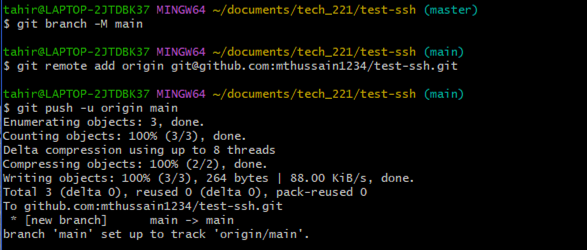

# Using SSH with GitHub

## Directory Reaction


We create a folder called `.ssh` which we will use to store our keys.
Using the function `mkdir` it allows us to create this directory which we will call `.ssh`
We use `ls` to explore the current directory, and use `cd` along with the directory name we wish to travel to.
In this case we use `cd.ssh`

## Keygen Creation


We use `ssh-keygen -t rsa -b 4096 -C "<your email address>"`.
This will allow us to generate both our Public and Private Key.
It will prompt us to create our file name, we simply use name-github-key.
Pressing enter when it asks for passphrase just lets us skip the passphrase section for now, but if you wish
to add a passphrase please do so.
Once done we can see it shows our key being saved to our directory.

## Viewing Public Keys


Using `cat name-github-key.pub`. We use `.pub` as two keys are generated since the last step.
This can be confimred by using `ls` in the key directory which will give us back two keys.
The `cat` will allow us to read the file, and in this case the key and it will give us our public key, which we can see above.

## Navigating GitHub 


On GitHub, navigate to profile settings, SSH keys, and click the red box you can see in the diagram above.


From this we will be greeted with an Add New section on GitHub. Where it says title, simply use your file name, in our case
it was name-github-key.pub.

In the Key section, copy and paste the key from `ssh-rsa...` just under the `cat` command as in the above picture.
Once pasted in, add the SSH key.

## Private Keys and Authentication


Once the public key has been added, we use:

The code above starting with `eval...`. `eval` takes the string as an argument and executes it as a command line.
`ssh-agent -s` launches the agent and outputs the commands. The backticks allow for bash to execute the command and allows for the use of `eval`.

Once entered use: `ssh-add name-github-key`. This time we use our Private Key as we didn't use `.pub` at the end.

We now use `ssh -T git@github.com` to check if it is authenticated.

## Creating the Repository (Local and Remote)


Going back to GitHub, we will create a new repository as shown above.


Changing the Repository name to ideally what the directory was saved as on your local system. In this case it was `test-ssh`.


We will now be greeted with the setup page. Click on SSH as that is what we are working with.


In accordance with the repository, we also create a local repository under `test-ssh` in our main folder.

Doing both `cd` `ls` help us see if any files were created. As we can see above nothing else was created.

Using `touch README.md`, it lets us create a README file within this respoitory.
` cat README.md` - `cat` is a command that is used to concatenate and display the contents of one or more files, and in this case we use it to display the `README.md`.
`nano README.md` - lets us edit the README.md contents through Git Bash itself, which we can see below.


Once edits have been made to the README, we initialse a git repository using `git init`.

Using `git status` check if the file is untracked, if so we use `git add .` to add everything that is untracked.

Following this we must use `git commit -m "xxxxx"` to state changes made.

## Pushing the Repository to GitHub



We use the code we saw on the **Setup** page for the git repository.

```
git branch -M main
git remote add origin git@github.com:<githubusername>/test-ssh.git
git push -u origin main
```
Once this has been pushed, we can see below that our changes and commits have been noted and updated on the GitHub itself.


